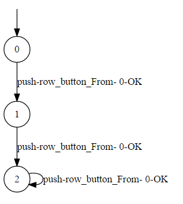
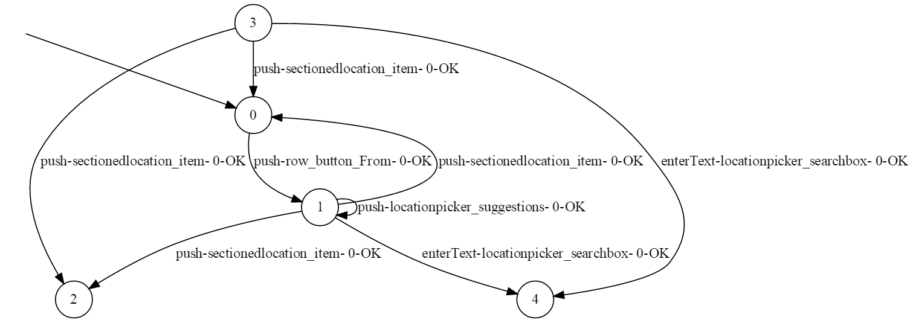

# Modifications

Fix and Create new `make_dump.sh` file with the following contents:

```shell
args=($@)
FILENAME=${args[0]}
adb shell uiautomator dump
echo ${FILENAME}
adb pull /sdcard/window_dump.xml alphabet/window_dumps/$FILENAME  
```

Download the source code from [here](https://github.com/bunqcom/fsm-learner). Upon compilation, two classes don't compile any more. The classes `AndroidInstrumentator.java` and `IOSInstrumentator.java`.  Both classes do not compile because they contain statements like:
```java
waitFor.until(ExpectedConditions.elementToBeClickable(By.xpath(xpath)));
```
These can be changed to the following code, because of **reason**:

```java
waitForLogin.until((Function<? super WebDriver, ?>) ExpectedConditions.elementToBeClickable(By.id("com.myApp.android:id/myBtn")));
```

Generate class files with `mvn compile` instead of `mvn install` to omit tests.

Modify the source code: Main.java contains the following method:
```java
private int runAlphabetScript(String fileName) {
  ...
  try {
    alphabetScript = Runtime.getRuntime().exec("scripts/make_dump.sh " + fileName);
    return alphabetScript.waitFor();
  } catch (IOException e) {
  ...
}
```

Modify the specified method to:
```java
private int runAlphabetScript(String fileName) {
  ...
  try {
    if(Runtime.getRuntime().exec("adb shell uiautomator dump").waitFor() != 0)
      return Runtime.getRuntime().exec("adb pull /sdcard/window_dump.xml alphabet/window_dumps/" + fileName).waitFor();
  } catch (IOException e) {
  ...
}
```

## Learning
When performing the learn action with the following command: `mvn exec:java -Dexec.mainClass="com.bunq.main.Main" -Dexec.args="learn"`, the following stack trace is generated:
```java
java.lang.reflect.InvocationTargetException
	at sun.reflect.NativeMethodAccessorImpl.invoke0(Native Method)
	at sun.reflect.NativeMethodAccessorImpl.invoke(NativeMethodAccessorImpl.java:62)
	at sun.reflect.DelegatingMethodAccessorImpl.invoke(DelegatingMethodAccessorImpl.java:43)
	at java.lang.reflect.Method.invoke(Method.java:498)
	at com.bunq.main.Main.execute(Main.java:244)
	at com.bunq.main.Main.main(Main.java:315)
	at sun.reflect.NativeMethodAccessorImpl.invoke0(Native Method)
	at sun.reflect.NativeMethodAccessorImpl.invoke(NativeMethodAccessorImpl.java:62)
	at sun.reflect.DelegatingMethodAccessorImpl.invoke(DelegatingMethodAccessorImpl.java:43)
	at java.lang.reflect.Method.invoke(Method.java:498)
	at org.codehaus.mojo.exec.ExecJavaMojo$1.run(ExecJavaMojo.java:282)
	at java.lang.Thread.run(Thread.java:745)
Caused by: java.lang.NoSuchMethodError: com.google.common.collect.ImmutableSet.toImmutableSet()Ljava/util/stream/Collector;
	at org.openqa.selenium.remote.ProtocolHandshake.streamW3CProtocolParameters(ProtocolHandshake.java:238)
	at org.openqa.selenium.remote.ProtocolHandshake.createSession(ProtocolHandshake.java:104)
	at org.openqa.selenium.remote.HttpCommandExecutor.execute(HttpCommandExecutor.java:141)
	at org.openqa.selenium.remote.RemoteWebDriver.execute(RemoteWebDriver.java:604)
	at io.appium.java_client.AppiumDriver.execute(AppiumDriver.java:180)
	at org.openqa.selenium.remote.RemoteWebDriver.startSession(RemoteWebDriver.java:244)
	at org.openqa.selenium.remote.RemoteWebDriver.<init>(RemoteWebDriver.java:131)
	at org.openqa.selenium.remote.RemoteWebDriver.<init>(RemoteWebDriver.java:158)
	at io.appium.java_client.AppiumDriver.<init>(AppiumDriver.java:109)
	at io.appium.java_client.android.AndroidDriver.<init>(AndroidDriver.java:39)
	at com.bunq.teacher.AndroidInstrumentator.startApp(AndroidInstrumentator.java:48)
	at com.bunq.teacher.FsmTeacher.start(FsmTeacher.java:36)
	at com.bunq.learner.SulAdapter.<init>(SulAdapter.java:51)
	at com.bunq.learner.FsmLearner.instantiateSuls(FsmLearner.java:162)
	at com.bunq.learner.FsmLearner.setUpLearner(FsmLearner.java:205)
	at com.bunq.main.Main.learn(Main.java:81)
	... 12 more
	Suppressed: java.io.IOException: Incomplete document
		at com.google.gson.stream.JsonWriter.close(JsonWriter.java:527)
		at org.openqa.selenium.remote.ProtocolHandshake.createSession(ProtocolHandshake.java:121)
		... 26 more
```

It appears that the class `AndroidInstrumentator` with method `startApp` causes the runtime error. The `AndroidInstrumentator` class takes care of all actions that can be executed on an Android device and depends heavily on Appium. Debugging the code, shows that the following statement within the `AndroidInstrumentator` class is responsible for the failure:
```java
driver = new AndroidDriver(new URL("http://127.0.0.1:4723/wd/hub"), capabilities);
```

Update Guave to 21.0 (https://github.com/google/error-prone/issues/528). Done by editing `pom.xml` with https://mvnrepository.com/artifact/com.google.guava/guava/21.0.

With updated Guava, another exception is thrown:
```java
Exception in AndroidInstrumentator:startApp
org.openqa.selenium.SessionNotCreatedException: Unable to create new remote session. desired capabilities = Capabilities [{appPackage=com.bunq.android, appActivity=com.bunq.android.ui.activity.MainActivity, noReset=false, newCommandTimeout=100, platformVersion=6.0.1, platformName=Android, deviceName=OnePlus X}], required capabilities = Capabilities [{}]
Build info: version: '3.3.1', revision: '5234b325d5', time: '2017-03-10 09:10:29 +0000'
System info: host: 'ubuntu', ip: '127.0.1.1', os.name: 'Linux', os.arch: 'amd64', os.version: '4.8.0-46-generic', java.version: '1.8.0_121'
Driver info: driver.version: AndroidDriver
	at org.openqa.selenium.remote.ProtocolHandshake.createSession(ProtocolHandshake.java:126)
	at org.openqa.selenium.remote.HttpCommandExecutor.execute(HttpCommandExecutor.java:141)
	at org.openqa.selenium.remote.RemoteWebDriver.execute(RemoteWebDriver.java:604)
	at io.appium.java_client.AppiumDriver.execute(AppiumDriver.java:180)
	at org.openqa.selenium.remote.RemoteWebDriver.startSession(RemoteWebDriver.java:244)
	at org.openqa.selenium.remote.RemoteWebDriver.<init>(RemoteWebDriver.java:131)
	at org.openqa.selenium.remote.RemoteWebDriver.<init>(RemoteWebDriver.java:158)
	at io.appium.java_client.AppiumDriver.<init>(AppiumDriver.java:109)
	at io.appium.java_client.android.AndroidDriver.<init>(AndroidDriver.java:39)
	at com.bunq.teacher.AndroidInstrumentator.startApp(AndroidInstrumentator.java:50)
	at com.bunq.teacher.FsmTeacher.start(FsmTeacher.java:36)
	at com.bunq.learner.SulAdapter.<init>(SulAdapter.java:51)
	at com.bunq.learner.FsmLearner.instantiateSuls(FsmLearner.java:162)
	at com.bunq.learner.FsmLearner.setUpLearner(FsmLearner.java:205)
	at com.bunq.main.Main.learn(Main.java:81)
	at sun.reflect.NativeMethodAccessorImpl.invoke0(Native Method)
	at sun.reflect.NativeMethodAccessorImpl.invoke(NativeMethodAccessorImpl.java:62)
	at sun.reflect.DelegatingMethodAccessorImpl.invoke(DelegatingMethodAccessorImpl.java:43)
	at java.lang.reflect.Method.invoke(Method.java:498)
	at com.bunq.main.Main.execute(Main.java:244)
	at com.bunq.main.Main.main(Main.java:315)
	at sun.reflect.NativeMethodAccessorImpl.invoke0(Native Method)
	at sun.reflect.NativeMethodAccessorImpl.invoke(NativeMethodAccessorImpl.java:62)
	at sun.reflect.DelegatingMethodAccessorImpl.invoke(DelegatingMethodAccessorImpl.java:43)
	at java.lang.reflect.Method.invoke(Method.java:498)
	at org.codehaus.mojo.exec.ExecJavaMojo$1.run(ExecJavaMojo.java:282)
	at java.lang.Thread.run(Thread.java:745)
```
After an insane amount of Googling and discussing the stack trace with other people, one can derive that Selenium cannot send HTTP requests to the AndroidDriver because the ProtocolHandshake continuously fails. This is due to the fact that Guava 21.0 (which has just been set) and Appium's java-client 2.1.0 are incompatible in terms of HTTP session establishment, which was the root cause for the failing ProtocolHandshake. Updating Appium's dependency configuration to the latest version: 5.0.0-BETA7, overcame the problem. No stable Appium version (latest stable is Appium 4.1.2) was able to make a successful handshake.

## Modify for own class

In order to modify the source code to learn the state machine model for another application, several functionalities had to be altered.

The `login()` method is used by different methods like the reset methods and after the AndroidDriver is started. Since this login function is very specific to the Bunq application and not many applications require a login screen, the login-functionality is overwritten by overriding the login-function as follows:
```java
/**
 * Does not login the user. Functions as a mock-up.
 */
public String login(String pin) {
  return "logged_in";
}
```


### configuration
androidConfig.properties contain `appPackage=com.bunq.android` and `appActivity=com.bunq.android.ui.activity.MainActivity`. For this example, the 9292 app is learned.

The following steps take care of the information:
```bash
wesley@ubuntu:~/Desktop$ adb shell pm path nl.negentwee
package:/data/app/nl.negentwee-1/base.apk
wesley@ubuntu:~/Desktop$ adb pull /data/app/nl.negentwee-1/base.apk .
893 KB/s (4766922 bytes in 5.212s)
wesley@ubuntu:~/Desktop$ ls
base.apk
wesley@ubuntu:~/Desktop$ mv base.apk 9292.apk
wesley@ubuntu:~/Desktop$ ls
9292.apk
wesley@ubuntu:~/Desktop$ aapt dump badging 9292.apk | grep launchable-activity
launchable-activity: name='nl.negentwee.activities.StartupActivity'  label='9292' icon=''
```

This gives the following information: appPackage=nl.negentwee` and `appActivity=nl.negentwee.activities.StartupActivity`

---
## Modifications for Correctness
*12-5-2017*


Inspecting the behavior of the first compiling run, one could see the following state machine:

This run was only run with the alphabet action push%row_button_From
As one could see there are three states: 0,1 and 2. State 2 is the `NOTFOUND` state. State 0 the initial menu and state 1 the menu where one can set the departing location. When learning the application, the 9292 app also shows to hang on state 1. All queries are performed from this state, result (obviously) in a `NOTFOUND`, causing the transition to state 2.
**Problem:** The FSM is incorrect.
**Hypothesis:** Learning from state 1 with all `NOTFOUND` transitions, cause the cache to contain all these query-answers. Hence these transitions are never learnt from state 0.
**Possible Solution:** Disable the custom made cache.

### Disable cache ###

Each input from `FSMTeacher` is given to the SUL. This is processed in the following method: `SulAdapter.step`:
```java
public String step(String in) {
  String output = "";
  currentQuery = currentQuery.addWord(in);

  try {
    output = cacheStep();
  } catch (QueryCacheMissException e) {
    output = nonCacheStep();
    currentQuery.addResult(output);
    cache.addQuery(currentQuery);
  }
  updateFastForward(output);
  return output;
}
```

The application always wants to perform a cacheStep first. Changing the step method to only invoke `nonCacheStep`-method would bluntly disable the cache. Attempting to do so, during the learning phase, the following runtime error is thrown:
```bash
An error occurred while executing 'learn'. The following error was given: net.automatalib.incremental.ConflictException: Error inserting push%//android.view.ViewGroup[1][@index='0' and @resource-id='android:id/decor_content_parent' and contains(@text, '') and @content-desc='']/android.widget.FrameLayout[2][@index='1' and @resource-id='android:id/content' and contains(@text, '') and @content-desc='']/android.widget.FrameLayout[1][@index='0' and @resource-id='' and contains(@text, '') and @content-desc='']/android.widget.ScrollView[1][@index='1' and @resource-id='nl.negentwee:id/planner_scrollable_content' and contains(@text, '') and @content-desc='']/android.widget.LinearLayout[1][@index='0' and @resource-id='' and contains(@text, '') and @content-desc='']/android.widget.TableLayout[1][@index='0' and @resource-id='nl.negentwee:id/planner_table' and contains(@text, '') and @content-desc='']/android.widget.TableRow[3][@index='2' and @resource-id='' and contains(@text, '') and @content-desc='']/android.widget.RelativeLayout[1][@index='0' and @resource-id='nl.negentwee:id/row_button_From' and contains(@text, '') and @content-desc='']#960#147 / 1-NOTFOUND: Incompatible output symbols: 1-NOTFOUND vs 0-OK
java.lang.reflect.InvocationTargetException
	at sun.reflect.NativeMethodAccessorImpl.invoke0(Native Method)
	at sun.reflect.NativeMethodAccessorImpl.invoke(NativeMethodAccessorImpl.java:62)
	at sun.reflect.DelegatingMethodAccessorImpl.invoke(DelegatingMethodAccessorImpl.java:43)
	at java.lang.reflect.Method.invoke(Method.java:498)
	at com.bunq.main.Main.execute(Main.java:247)
	at com.bunq.main.Main.main(Main.java:318)
	at sun.reflect.NativeMethodAccessorImpl.invoke0(Native Method)
	at sun.reflect.NativeMethodAccessorImpl.invoke(NativeMethodAccessorImpl.java:62)
	at sun.reflect.DelegatingMethodAccessorImpl.invoke(DelegatingMethodAccessorImpl.java:43)
	at java.lang.reflect.Method.invoke(Method.java:498)
	at org.codehaus.mojo.exec.ExecJavaMojo$1.run(ExecJavaMojo.java:282)
	at java.lang.Thread.run(Thread.java:745)
Caused by: net.automatalib.incremental.ConflictException: Error inserting push%//android.view.ViewGroup[1][@index='0' and @resource-id='android:id/decor_content_parent' and contains(@text, '') and @content-desc='']/android.widget.FrameLayout[2][@index='1' and @resource-id='android:id/content' and contains(@text, '') and @content-desc='']/android.widget.FrameLayout[1][@index='0' and @resource-id='' and contains(@text, '') and @content-desc='']/android.widget.ScrollView[1][@index='1' and @resource-id='nl.negentwee:id/planner_scrollable_content' and contains(@text, '') and @content-desc='']/android.widget.LinearLayout[1][@index='0' and @resource-id='' and contains(@text, '') and @content-desc='']/android.widget.TableLayout[1][@index='0' and @resource-id='nl.negentwee:id/planner_table' and contains(@text, '') and @content-desc='']/android.widget.TableRow[3][@index='2' and @resource-id='' and contains(@text, '') and @content-desc='']/android.widget.RelativeLayout[1][@index='0' and @resource-id='nl.negentwee:id/row_button_From' and contains(@text, '') and @content-desc='']#960#147 / 1-NOTFOUND: Incompatible output symbols: 1-NOTFOUND vs 0-OK
	at net.automatalib.incremental.mealy.dag.IncrementalMealyDAGBuilder.insert(IncrementalMealyDAGBuilder.java:284)
	at de.learnlib.cache.sul.SULCache$SULCacheImpl.post(SULCache.java:146)
	at de.learnlib.cache.sul.SULCache.post(SULCache.java:224)
	at de.learnlib.oracles.SULOracle.answerQuery(SULOracle.java:104)
	at de.learnlib.oracles.SULOracle.processQueries(SULOracle.java:81)
	at de.learnlib.oracles.SULOracle.processQueries(SULOracle.java:74)
	at de.learnlib.algorithms.lstargeneric.table.ObservationTable.initialize(ObservationTable.java:185)
	at de.learnlib.algorithms.lstargeneric.AbstractLStar.startLearning(AbstractLStar.java:77)
	at de.learnlib.algorithms.lstargeneric.AbstractAutomatonLStar.startLearning(AbstractAutomatonLStar.java:185)
	at de.learnlib.experiments.Experiment$ExperimentImpl.run(Experiment.java:76)
	at de.learnlib.experiments.Experiment.run(Experiment.java:130)
	at com.bunq.learner.FsmLearner.runExperiment(FsmLearner.java:225)
	at com.bunq.main.Main.learn(Main.java:86)
	... 12 more
```
Dissecting the error shows that when performing the action `push%From` (simplified / to go to the menu of departures) the new output symbol is incompatible with the learnt output symbol. Looking how the graph looks with cache, the `push%From` results in the following transitions:
`	s0 -> s1 [label="push-row_button_From- 0-OK"]; `
` s1 -> s2 [label="push-row_button_From- 1-NOTFOUND"]; `
Likely this is due to the fact that initially the query was cached, and without the cache, learning can't cope with different results for the same query. But why can't it cope with that, since they are clearly in a different state?
Thought possibilities: going back is not in the alphabet? (reset does...). Possible commands from state 1 are not known! Create new alphabet from this state.
The same happens when providing the alphabet available from state 1. First it goes to state 1, then to state 2, hanging there.

[this](https://groups.google.com/forum/#!topic/learnlib-qa/iSEOvwsH3Cc) shows that it is probably due to an incorrect SUT reset function. To see how resetting is done, one must examine the function-calls while learning. The following section gives a small overview, and a discussion on how resetting is implemented:

#### learning
The following shows the learning cycle:
```java
FsmLearner learner = new FsmLearner();
learner.setUpLearner();
    loadAlphabet();  -> alphabet.add(line)
    instantiateSuls(); -> new SulAdapter();
learner.runExperiment(); -> experiment.run()
    each query: pre() -> handlePreReset() && sendKeepAlive();
    // handlePreReset sets option 'hardReset' to false, WHY? It won't set a reset anymore.
    // sendKeepAlive is dependent per device setting: tries to not have the application go to black screen
learner.printResults();
```
The class `SulAdapter` contains three boolean values: `softReset`, `semiSoftReset` and `hardReset`. Reading from the context follows that `hardReset` is the strongest one. It would therefor be the best case to use a `hardReset` when trying to make this work.
As noted in the function-call analysis, the handlePreReset, handles all options before resetting, and after one reset, sets the `hardReset` to false after which a `hardReset` will never be performed anymore. This also accounts to the other reset types. Disabling the option of setting the `hardReset` to false immediately shows results, the application can now learn without the cache.

### Exploring state 1 ###

Exploring state 1 constitutes with the menu after pressing the 'From' button on the main screen of the 9292 application. Learning the state machine for this part dramatically increased in time. This is mainly due to the `hardReset` function that has to be executed each time. Restarting the application takes approximately 6 seconds for the 9292 app. Another factor that increases the learning time, is that it now also learns other states.

The eventual time for learning the 'From'-part of the application took a total time of 01:13 hours! The results look as follows:


The FSM logs that accompany the FSM image can be found [here](https://raw.githubusercontent.com/wesleyvanderlee/Thesis/master/Literature/BSc.%20FSM%20Learner/runs/run1205-4).
